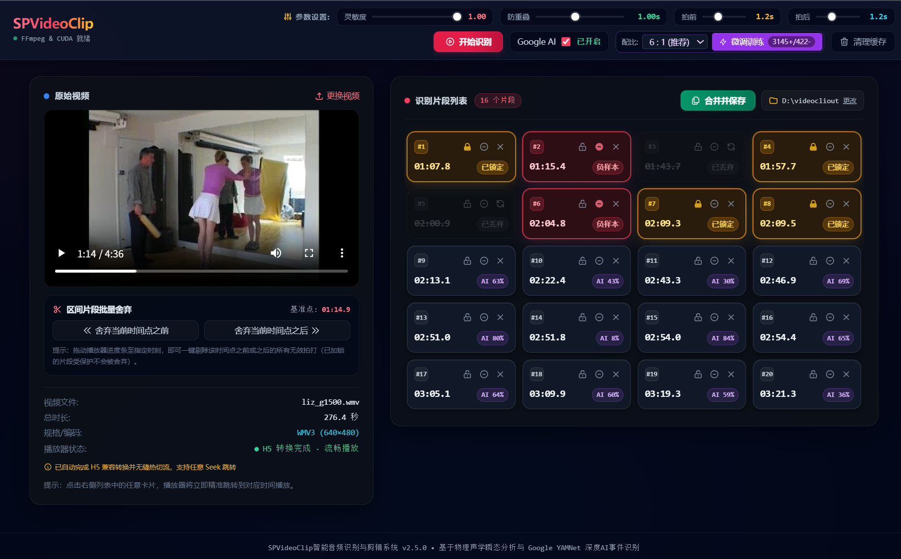

# SPVideoClip - SP视频拍打声智能识别与定点剪辑合并系统

<p align="center">
  <a href="https://github.com/kiddsong/spvideoclip"></a>
  
  
  
  
  <a href="./LICENSE"></a>
</p>

**SPVideoClip** 是一款基于 **双轨声学物理瞬态特征分析**、**Google YAMNet 深度事件识别模型** 与 **主动学习（Active Learning）本地微调** 的全自动 SP 视频智能剪辑合成系统。

本系统针对 SP 视频中特定的人体碰撞/抽打/拍打声（Slap / Whip / Impact）进行微秒级定点捕获，自动生成毫秒级平滑过渡区间，并提供全功能现代 H5 交互控制台，支持零拷贝极速导入、四色交互卡片微调、样本自主学习训练以及一键无缝合并输出。

**只看打戏，不看文戏**

> ⚠️ **重要提示与准入须知**：  
> 本项目中所述的“SP”，系 BDSM 中的 spanking 分类，中文术语一般为“小圈”。如您是误入本项目或属于未成年人（以您所在国家/地区法律规定的成年年龄和您的法定身份为准），**请勿继续阅读或使用本系统，并请主动关闭离开本页面**。

---

## 目录

- [一、项目背景与设计目的](#一项目背景与设计目的)
- [二、核心实现原理](#二核心实现原理)
  - [1. 双轨声学 + 深度语义识别引擎](#1-双轨声学--深度语义识别引擎)
  - [2. 闭环主动学习机制（Active Learning）](#2-闭环主动学习机制active-learning)
  - [3. 智能区间生成与自适应平滑熔接](#3-智能区间生成与自适应平滑熔接)
  - [4. 双剑合璧极速流控与预览转码架构](#4-双剑合璧极速流控与预览转码架构)
- [三、核心功能特性](#三核心功能特性)
- [四、界面展示与交互状态说明](#四界面展示与交互状态说明)
- [五、设备与环境要求](#五设备与环境要求)
- [六、安装与环境配置指南](#六安装与环境配置指南)
- [七、快速开始与操作指南](#七快速开始与操作指南)
- [八、项目目录架构](#八项目目录架构)
- [九、常见问题与注意事项（FAQ）](#九常见问题与注意事项faq)
- [十、免责声明 (Disclaimer)](#十免责声明-disclaimer)
- [十一、版权与开源许可 (License & Credits)](#十一版权与开源许可-license--credits)

---

## 一、项目背景与设计目的

在 SP 视频内容的后期整理与精彩集锦制作中，往往需要从数十分钟甚至数小时的长篇素材中挑出“拍打/击打”动作的高光瞬间。传统人工检索方式耗时费力，且常规依靠单一音量（RMS）阈值的剪辑软件极易受到关门、说话、脚步声、爆破等各种环境噪音的干扰，产生海量误报。

**SPVideoClip 的核心目标：**
1. **高召回与高精度兼备**：不仅能够精准捕获肉体皮肤拍打的短时瞬态冲激，更能通过神经网络语义排除非拍打噪音。
2. **极速零拷贝操作**：消除传统 Web 剪辑工具动辄数分钟的上传与重复转码等待，实现电脑本地文件的瞬时解析与毫秒级 Seek。
3. **越用越聪明的专属 AI**：允许用户在剪辑过程中对片段进行加锁（正向）或标记负面（排除），一键在本地微调专属分类头，适应特定录制环境。

---

## 二、核心实现原理

```
[原始视频 (MP4/MOV/WMV/RM/AVI...)]
           │
           ├──► [音频流极速抽取] ──► 22050Hz 高保真单声道分析 WAV
           │                             │
           │                             ├─► [第一轨: 物理声学瞬态特征分析]
           │                             │     ├─ 200Hz~5500Hz 人体拍打能量带过滤
           │                             │     ├─ Onset Strength 瞬态冲激包络
           │                             │     ├─ 短时 RMS 动态能量峰值检测
           │                             │     └─ 频谱质心 (Spectral Centroid) 质感过滤
           │                             │
           │                             └─► [第二轨: Google YAMNet 深度语义网络]
           │                                   ├─ 提取 1024 维深度特征 Embedding
           │                                   ├─ YAMNet 主干网络识别 (Slap & Whip 类别)
           │                                   └─ 本地微调定制头 (Logistic Custom Head)
           │
           ▼
[候选拍击时间戳列表] ──► [时序非极大值抑制 (NMS)] ──► [前后缓冲扩充 [-Pre, +Post]] 
           │
           ▼
[自适应区间融合引擎] ──► 自动熔接相邻 < 0.5s 区间 ──► [最终保留裁剪区间列表]
           │
           ▼
[FFmpeg 精确编解码与 Concat 流水线] ──► [输出无缝合并成片]
```

### 1. 双轨声学 + 深度语义识别引擎
- **物理声学第一轨（高召回定位）**：
  人体拍打或抽打声在物理声学上表现为**高能量瞬态脉冲**与**极短的肉体阻尼衰减**。系统将音频限制在 `200Hz ~ 5500Hz` 敏感频带内，提取短时傅里叶变换（STFT）谱能量、Onset Strength 包络、RMS 均方根能量与频谱质心，利用自适应标准差动态阈值配合非极大值抑制（NMS），精确定位冲激发生的毫秒时刻。
- **神经网络第二轨（高精准排杂）**：
  基于 Google YAMNet 深度卷积模型（ONNX 跨平台引擎），针对每一个声学脉冲点提取周围上下文的 **1024 维音频语义特征向量**。模型直接聚焦于 AudioSet 语义标准中的 `Class 461: Slap, smack` 与 `Class 466: Whip`，有效阻断大声说话、尖叫、关门碰击等传统算法无法区分的环境假阳性。

### 2. 闭环主动学习机制（Active Learning）
- 系统内置 `YAMNetTuner` 本地微调器。当用户在剪辑界面对片段执行“加锁”或“最终合成”时，该片段的 1024 维特征向量将作为**正样本（Label 1）**自动沉淀；当点击“标记负面”或“批量舍弃”时，将作为**负样本（Label 0）**沉淀。
- 采用**智能样本配额平衡器（Adaptive Sample Quota & Balancing）**：对负样本 100% 优先保留，对大量正样本进行多样性下采样，配合 `class_weight='balanced'` 逻辑回归模型，用户随时可点击【微调训练】，在 0.5 秒内训练出贴合自己设备与音频风格的专属模型。

### 3. 智能区间生成与自适应平滑熔接
- 针对识别出的每一个拍打点 $T$，根据用户设置的“拍前缓冲”（默认 1.2s）与“拍后缓冲”（默认 1.2s）扩展为时间区间 $[T - \text{pre}, T + \text{post}]$。
- 内置**动态区间融合算法**：若前后两个区间的间隔小于门限（0.5s），系统会自动将其平滑连通为一个完整片段，杜绝视频合成时画面闪烁、频繁卡顿或语意被突兀切断的碎片化问题。

### 4. 双剑合璧极速流控与预览转码架构
- **现代 H.264 视频**：系统通过底层文件描述符实现 0 拷贝瞬时加载，零网络传输、零等待，直接原生秒开播放。
- **经典传统格式（WMV / RMVB / RM / AVI / MKV / FLV 等）**：内置智能格式探测，自动通过 FFmpeg 后台启动硬件/CPU `480p ultrafast` 超轻量代理流转码（最高可达 35x~40x 倍速），前台 300ms 高频平滑追踪进度，转码完成自动无缝切换，完全不阻碍用户同步发起识别分析。

---

## 三、核心功能特性

| 功能模块 | 说明 |
| :--- | :--- |
| **全格式兼容支持** | 原生兼容 MP4、MOV、WebM；深度支持经典老旧格式（WMV、RM、RMVB、AVI、MKV、FLV、MPEG 等）。 |
| **零网络开销秒开** | 支持 Windows 原生文件对话框直选，毫秒级读取磁盘视频，无需漫长等待将几 GB 的视频上传至服务器。 |
| **四色卡片状态机** | 识别片段卡片提供清晰的四色状态控制：**绿（当前激活播放）**、**黄（加锁保留/正样本）**、**红（标记负样本）**、**灰（废弃删除）**。 |
| **区间批量舍弃** | 支持在播放器任意时刻点击“舍弃当前时间点之前”或“之后”，一键剔除无效片头或片尾。 |
| **自定义导出路径** | 允许用户自由设定成品保存目录（如移动硬盘或其他磁盘分区），合并后直出目标目录，无需二次拷贝。 |
| **一键资源回收** | 顶部工具栏集成“清理缓存”功能，一键安全释放识别过程中产生的临时音频和轻量转码流，不影响成片。 |

---

## 四、界面展示与交互状态说明



### 卡片按钮交互说明
- 🔒 **加锁按钮（变黄）**：锁定该片段，后续的批量舍弃操作将**不会**误伤该片段；同时自动入库为 **AI 正样本**。
- ⛔ **负面按钮（变红）**：将该片段标记为噪音误报，合成时自动排除；同时自动入库为 **AI 负样本**，作为模型学习材料。
- ✕ **删除按钮（变灰）**：临时废弃该片段，合成时不予打包。再次点击可取消删除恢复原状。
- **点击卡片任意区域**：播放器立即精准 Seek 到该动作发生瞬间（变绿），便于快速回看核验。

---

## 五、设备与环境要求

### 1. 操作系统
- **Windows**：Windows 10 / 11（64-bit，最佳推荐，提供原生文件拾取器支持）。

### 2. 硬件配置
- **显卡（GPU）**：纯 CPU 即可全速流畅运行。若系统配备 NVIDIA 显卡并配置了 NVENC，可自动获得硬件加速支持。

### 3. 第三方外部依赖
- **FFmpeg & FFprobe**：**核心必须组件**。
  - 需要在系统终端中直接执行 `ffmpeg -version` 与 `ffprobe -version` 无报错。

---

## 六、安装与环境配置指南

### 第一步：克隆代码仓库
```bash
git clone https://github.com/kiddsong/spvideoclip.git
cd spvideoclip
```

### 第二步：创建并激活虚拟环境（推荐）
```bash
# Windows
python -m venv venv
venv\Scripts\activate

### 第三步：安装 Python 依赖项
```bash
pip install -r requirements.txt
```

> **依赖说明**：`requirements.txt` 中包含 FastAPI、Librosa、Scipy、NumPy、scikit-learn、joblib、onnxruntime 等科学计算与服务组件。

### 第四步：安装并配置 FFmpeg
- **Windows 用户**：
  1. 前往 [Gyan.dev FFmpeg Builds](https://www.gyan.dev/ffmpeg/builds/) 下载 `ffmpeg-release-essentials.zip`。
  2. 解压并将 `bin` 目录绝对路径（如 `C:\ffmpeg\bin`）添加到系统的 **系统环境变量 -> Path** 中。
  3. 打开新的命令提示符，输入 `ffmpeg -version` 确认安装成功。

---

## 七、快速开始与操作指南

### 1. 一键启动服务
运行根目录下的启动脚本：
```bash
python run.py
```
*(Windows 用户也可直接双击根目录下的 `start.bat`)*

系统会自动启动并在默认浏览器中唤起交互界面：
```text
http://127.0.0.1:8000
```

### 2. 完整操作流水线
1. **载入视频**：
   - 点击界面左侧的【浏览选择电脑中的视频 (0.1秒秒开)】，通过原生文件窗口直接点选任意磁盘中的视频；
   - 或直接将本地视频文件拖入上传虚线框。
2. **参数设定与识别**：
   - 顶部提供识别参数微调：
     - **识别灵敏度**（0.10 ~ 1.00，默认 `1.00`）：值越高捕获越微弱的击打。
     - **防重叠间隔**（默认 `1.0s`）：限制连续拍打的最小去重时间。
     - **拍前/拍后扩充**（默认各 `1.2s`）：单个动作片段的保留缓冲时长。
     - **AI 语义精滤**：默认勾选开启 Google YAMNet 深度判定。
   - 点击右上角红色的【开始识别】按钮，后台将在数秒内完成音频分析与事件打标。
3. **核对与快速修整**：
   - 右侧列表将呈现所有捕获到的动作卡片；
   - 点击任意卡片跳转播放核对画面；若遇误报，可点击红色的 `⛔`（标记负样本）或灰色的 `✕`（删除）；对重要片段可点击 `🔒`（加锁）；
   - 若前奏或片尾存在长时间无关内容，可拖动进度条后点击【舍弃当前时间点之前/之后】进行批量剔除。
4. **自主微调训练（可选）**：
   - 当积累了一定数量的加锁片段与负面片段后，顶部微调面板的样本数徽章将点亮；
   - 选择期望的训练正负配比（推荐 6:1），点击【微调训练】，模型将在毫秒内完成自我进化。
5. **合并保存**：
   - 可在右侧操作栏点击【设置】图标修改成片保存目录（默认为 `D:\videocliout`）；
   - 点击绿色的【合并并保存】按钮，后台将自动调起 FFmpeg 进行毫秒级精准裁剪与拼接；
   - 合并完成后，界面会弹出保存成功提示，**点击文字即可直接在系统的文件资源管理器中打开成片所在文件夹**。

---

## 八、项目目录架构

```text
spvideoclip/
├── core/
│   ├── audio_extractor.py       # 视频元数据解析、H5兼容检测与极速预览流转码
│   ├── impact_detector.py       # 双轨声学瞬态分析与 NMS 候选点检测
│   ├── yamnet_classifier.py     # YAMNet ONNX 模型推理与 1024 维特征抽取
│   ├── yamnet_tuner.py          # 主动学习样本库管理与本地专属分类头微调
│   ├── video_cutter.py          # FFmpeg 毫秒级片段重编码切割与快速拼接
│   └── pipeline.py              # 全流程状态机、异步线程与任务调度中枢
│
├── models/
│   ├── yamnet.onnx              # Google YAMNet 官方主干网络权重
│   ├── yamnet_class_map.csv     # AudioSet 类别映射表 (关注 461/466)
│   ├── feedback_samples.npz     # 用户主动学习沉淀的样本库 (自动生成)
│   └── yamnet_custom_head.joblib# 本地微调得到的专属头分类器 (自动生成)
│
├── web/
│   ├── app.py                   # FastAPI 服务路由、流式传输与 REST API
│   ├── templates/
│   │   └── index.html           # 现代深色流光 H5 控制台单页
│   └── static/
│       ├── css/style.css        # 自定义卡片状态机与动画样式
│       └── js/app.js            # 前端全交互逻辑与高频平滑轮询
│
├── storage/                     # 运行缓存目录 (受 .gitignore 保护)
│   ├── uploads/                 # 代理流及上传缓存
│   ├── audio/                   # 提取的高保真单声道分析 WAV
│   └── outputs/                 # 合并暂存目录
│
├── run.py                       # Python 启动脚本入口
├── start.bat                    # Windows 快速双击启动批处理
├── requirements.txt             # 项目依赖清单
├── LICENSE                      # 开源许可证 (MIT)
└── README.md                    # 项目官方详细技术文档
```

---

## 九、常见问题与注意事项（FAQ）

#### Q1: 为什么我的 WMV / RM / AVI 视频在导入后需要稍作等待？
> 现代浏览器（Chrome、Edge、Safari、Firefox）的 H5 `<video>` 容器原生仅支持 H.264 / VP8 / VP9 等编码，不支持老旧的 WMV3 或 RealMedia RV40 编码。系统为了保证网页内能够流畅拖动 Seek，会在导入时自动在后台启动极速 480p 代理流转码。得益于 ultrafast 算法，一般视频仅需数秒至十余秒即可就绪，且不影响您同时点击【开始识别】。

#### Q2: 出现 "无法定位 ffmpeg" 或 FFmpeg 抛错退出怎么办？
> 请确保已按本指南【第六节】将 FFmpeg 安装并加入到系统环境变量 `Path` 中。在终端中执行 `ffmpeg -version`，如能打印版本号即说明配置正确。

#### Q3: 微调训练按钮提示“正负样本不足”？
> 微调分类头需要基本的统计鉴别能力。您只需要在审查片段时，通过 `🔒` 标记至少 2 个正样本，并通过 `⛔` 或批量舍弃产生至少 2 个负样本，即可激活训练。训练仅需零点几秒，在本地即可完成，不会向云端上传任何隐私数据。

#### Q4: 合并后的视频画质会受损吗？
> 不会。网页预览阶段使用的是极速 480p 轻量预览流，而在最终点击【合并并保存】时，系统会**回溯到原始高清视频源文件**进行高保真重编码（CRF=18，接近无损视觉感知）与精确剪辑，确保输出的成品拥有与原片完全一致的画质与清晰度。

---

## 十、免责声明 (Disclaimer)

1. **合法合规与成人准入原则**：
   - 本项目属于多媒体信号处理、声学事件检测（AED）与本地自动化剪辑工具。
   - 本项目及相关说明仅供**年满 18 周岁（或符合用户所在地司法管辖区法定成年年龄）且具备完全民事行为能力的成年人**在私人合法领域中依个人意愿研究、学习及正当创作使用。**严禁未成年人接触、查阅或使用本软件。**
2. **知情同意与非侵害原则（SSC / RACK 原则）**：
   - 任何涉及特定亚文化（如 SP/小圈）音视频素材的处理，必须完全建立在**所有参与者知情、自愿且明确同意（Safe, Sane, Consensual / Risk-Aware Consensual Kink）**的基础之上。
   - **严禁**将本软件用于任何形式的暴力虐待、人身伤害、非法拘禁、家庭暴力、非自愿胁迫、偷拍窃密、侵犯他人隐私权或肖像权的违法违规行为。
3. **禁止非法分发与不良信息传播**：
   - **严禁**利用本软件制作、剪辑、存储或通过互联网传播任何违反国家法律法规、侵犯社会公德或侵害他人合法权益的淫秽色情、暴力血腥或不良信息视频内容。
4. **纯本地离线处理与责任豁免**：
   - 本软件是一套**纯本地运行的开源脚本工具**，所有音视频解析、神经网络推理与剪辑渲染均在使用者自身的计算机本地离线完成，**开发者既不提供任何云端服务器托管、转码或存储服务，亦不收集或传输用户的任何个人隐私及视频媒体内容**。
   - 本项目按“现状”（AS IS）提供，开发者不对软件的准确性、完整性或对特定用途的适用性做任何明示或暗示的担保。
   - 用户使用本软件即代表**完全知悉并自愿遵守上述全部条款**。对于用户因违反法律法规或不正当使用本软件而导致的任何民事赔偿、行政处罚或刑事处罚等直接、间接或连带责任，**均由使用者自行独立承担，开发者及开源贡献者概不承担任何法律责任**。

---

## 十一、版权与开源许可 (License & Credits)

- **源代码许可**：本项目基于 [MIT License](./LICENSE) 协议开源。
- **Google YAMNet**：Google YAMNet 音频事件分类模型及权重由 Google LLC 研发并开源，遵循 [Apache License 2.0](https://www.apache.org/licenses/LICENSE-2.0)。
- **Wavesurfer.js**：音频波形可视化库基于 [Wavesurfer.js](https://wavesurfer.xyz/)，遵循 [BSD-3-Clause License](https://opensource.org/licenses/BSD-3-Clause)。
- **其他第三方组件**：FastAPI、Librosa、ONNX Runtime、Scikit-learn、FFmpeg 等遵循其各自的开源许可证。
